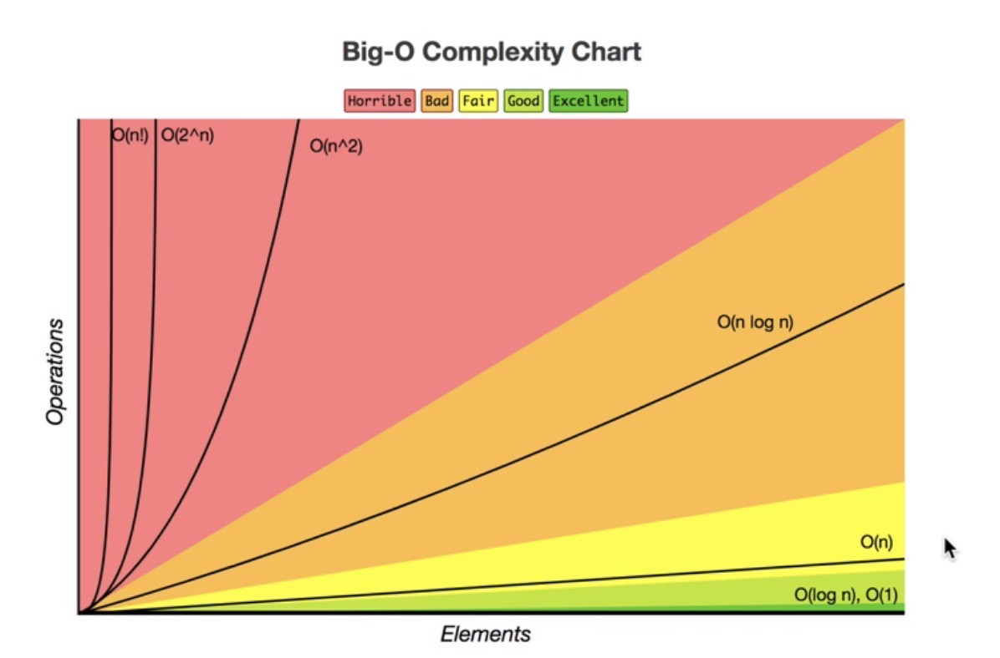
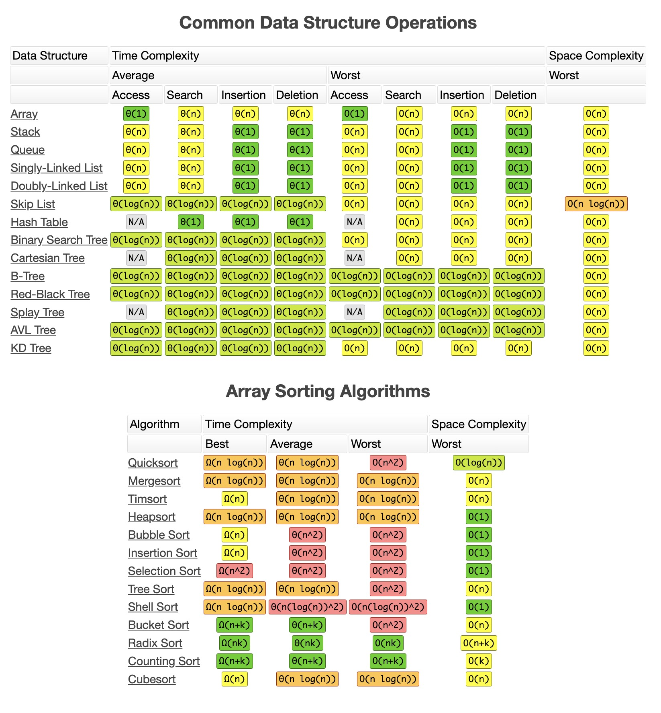
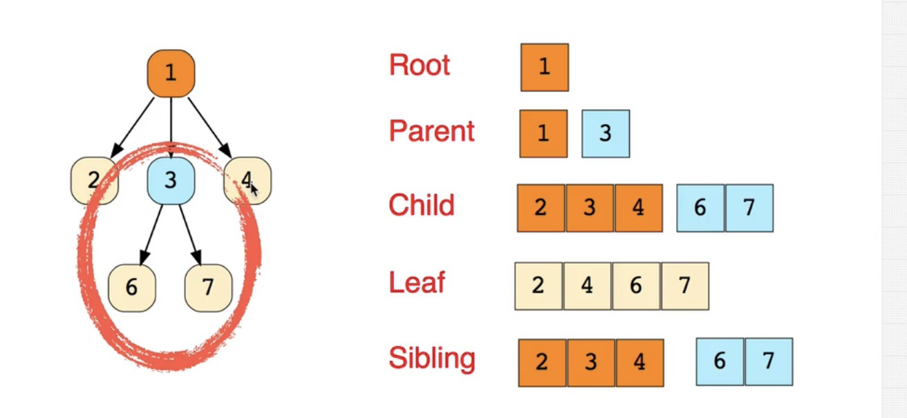
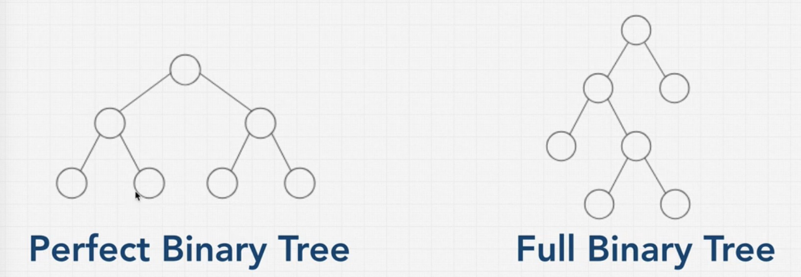

# AlgoLabs

重学算法之旅～

这是跟着 [Master the Coding Interview: Data Structures + Algorithms](https://www.udemy.com/course/master-the-coding-interview-data-structures-algorithms/learn/lecture/12364320#questions) 这门课程重新学习算法的代码，以 JavaScript 实现为主，后续再以 Golang 代码实现。

------------

``参考书籍``
* 《大话数据结构》
* 《算法图解》
* 《我的第一本算法书》

``其他参考``
- [Binary Tree](https://www.cnblogs.com/idorax/p/6441043.html)

------------

### 资源网站
[课程思维导图](https://coggle.it/diagram/W5E5tqYlrXvFJPsq/t/master-the-interview-click-here-for-course-link)

[学习交流社区](https://replit.com)

[Visualgo](https://visualgo.net/zh/bst?slide=1)

[Bigocheatsheet](https://www.bigocheatsheet.com/)

### Big O

### Tree

``Tree Introduction（术语）``

``Binary Tree``

Perfect Binary Tree (完美二叉树)

    完美二叉树(PBT)是一种所有叶子结点都在相同深度的树，除了叶子结点，每个结点都有两个子结点。

Full Binary Tree (完满二叉树)
    
    完满二叉树(FBT)，除叶子结点外的每个结点都有两个子结点。

Binary Search Tree (二叉搜索树)  
      
    二叉搜索树（又：二叉查找树，二叉排序树，Binary Search Tree，BST）是一种二叉树;
    二叉搜索树性质：左子树上所有结点的值均小于它的根结点的值以及右子树上所有结点的值均大于它的根结点的值。简单来说就是“每个结点的值均大于其左子树上任意一个结点的值，每个结点的值均小于其右子树上任意 一个结点的值“

    

